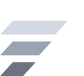

# Limina Labs — brand asset kit

Enterprise AI that can be trusted to act.

## Colour

- Cobalt ramp (light themes): `#0B1FA6` → `#2F47C4` → `#7F8FDD` → `#B7C0EA`
- Frost ramp (dark themes): `#FFFFFF` → `#D3D9E2` → `#9AA3AF` → `#6B7480`
- Flat fallbacks: `#0B1FA6` on light, `#FFFFFF` on dark, `#14181B` for single-ink print
- Deepest value always sits on the longest bar; flip the order on dark grounds.

## Type

Wordmark: Bricolage Grotesque — 600 for "Limina", 400 for "Labs". UI/body: Archivo.

## Geometry rules

- Clear space: 0.28 x mark width on all sides
- Minimum size: 18px wide, flat colour only (the four-step ramp holds down to 24px)
- Lockup: wordmark size = 0.5 x mark width, gap = 0.28 x mark width
- Never recolour bars individually, never loop the logo itself

## Motion — what to use when

| Animation | Where | Duration | Loops |
| --- | --- | --- | --- |
| Lift (`animated/limina-lift-*.svg`) | The logo's only animation: app launch, splash, login, marketing hero, first slide — and hover on the nav or footer logo | 0.66s | no, once per trigger |
| March (`animated/limina-hover-march-*.svg`) | Hover on brand buttons and bar-only brand surfaces. Never the logo. | 2.4s | while hovered |
| Trail (`animated/limina-loader-trail-*.svg`) | Loading, in-flight requests | 3.2s | yes |
| Relay (`animated/limina-progress-relay-*.svg`) | Multi-step progress: spec written, checks running, evidence recorded | 2.8s | yes |

Motifs are the bars only — they carry no logo status, which is why they may loop. Inside a product the logo appears only in brand moments.

The logo animates with Lift and nothing else, including on hover. March is a motif, so pointing it at the logo would have given a looping animation logo status — the one thing this table exists to prevent. Hovering the mark replays Lift instead: still one shot, still the logo's own animation.

### How to use the motion

`animated/*.svg` are self-contained animated SVG files — the animation is inside the file (SMIL), so they play with no CSS and no JavaScript:

```html

```

They also work as CSS `background-image`, in an `<object>`, or opened directly in a browser. Each animation ships in cobalt (light grounds) and frost (dark grounds).

If you would rather drive the animation from your own stylesheet — for example to run March only on `:hover`, or to respect `prefers-reduced-motion` with your own rules — `web-snippets/limina-motion.css` holds the same four animations as CSS keyframes, with four runnable HTML examples beside it.

## Using this in an interface

`design-system/` turns this kit into a working interface layer — tokens, glass
surfaces and components built from the ramps, the mark's geometry and these four
animations. Open `design-system/index.html` for the living spec. Use it for
anything rendered in a browser; use the files here for email, decks, app icons
and anywhere CSS cannot reach.

## Brand architecture

One mark for the company. Products are named in the wordmark's type ("Limina Spec", "Limina Ledger"), never given their own logo or new geometry. A product may take one colour from the ramp as an accent.

## Web head snippet

```html
<link rel="icon" href="/favicon.svg" type="image/svg+xml">
<link rel="icon" href="/favicon.ico" sizes="any">
<link rel="icon" href="/favicon-32.png" sizes="32x32">
<link rel="apple-touch-icon" href="/icon-180-light.png">
<link rel="manifest" href="/manifest.webmanifest">
<meta name="theme-color" content="#0b1fa6">
<meta property="og:image" content="/og-image-1200x630-dark.png">
```

## Where each social file goes

| Platform | Slot | File |
| --- | --- | --- |
| LinkedIn | Company logo / personal photo | `social/avatar-400-*.png` |
| LinkedIn | Company page cover | `social/linkedin-company-cover-1128x191-*.png` |
| LinkedIn | Personal profile banner | `social/linkedin-banner-1584x396-*.png` |
| YouTube | Channel art (safe area centred) | `social/youtube-channel-art-2560x1440-*.png` |
| YouTube | Video thumbnail | `social/youtube-thumbnail-1280x720-*.png` |
| YouTube / X / Instagram / GitHub / Slack | Profile picture | `social/profile-1080x1080-*.png` |
| X | Header | `social/x-header-1500x500-*.png` |
| Facebook | Page cover | `social/facebook-cover-1640x664-*.png` |
| Instagram / LinkedIn / X | Square post | `social/post-1080x1080-*.png` |
| Instagram / TikTok / LinkedIn | Story, vertical | `social/story-1080x1920-*.png` |
| Any site / app | Link share card (og:image) | `social/og-image-1200x630-*.png` |
| Email, Slack, Notion | Header strip | `social/header-strip-1200x300-*.png` |

Every file ships `-light` and `-dark`. Use `-dark` on platforms with a white UI when you want the mark to hold its own; `-light` when the surrounding page is already dark or you need a quieter presence.

## File index

### (root)

- README.md
- manifest.webmanifest

### mark

- limina-mark-cobalt-flat.svg
- limina-mark-cobalt.svg
- limina-mark-frost.svg
- limina-mark-ink.svg
- limina-mark-white.svg

### mark-png

- limina-mark-cobalt-1024.png
- limina-mark-cobalt-128.png
- limina-mark-cobalt-256.png
- limina-mark-cobalt-512.png
- limina-mark-cobalt-flat-256.png
- limina-mark-frost-1024.png
- limina-mark-frost-128.png
- limina-mark-frost-256.png
- limina-mark-frost-512.png
- limina-mark-ink-256.png
- limina-mark-white-256.png

### lockup

- limina-lockup-horizontal-dark.svg
- limina-lockup-horizontal-dark@4x.png
- limina-lockup-horizontal-light.svg
- limina-lockup-horizontal-light@4x.png
- limina-lockup-stacked-dark.svg
- limina-lockup-stacked-dark@4x.png
- limina-lockup-stacked-light.svg
- limina-lockup-stacked-light@4x.png

### animated

- limina-hover-march-cobalt.svg
- limina-hover-march-frost.svg
- limina-lift-cobalt.svg
- limina-lift-frost.svg
- limina-loader-trail-cobalt.svg
- limina-loader-trail-frost.svg
- limina-progress-relay-cobalt.svg
- limina-progress-relay-frost.svg

### favicon

- favicon-16-dark.png
- favicon-16.png
- favicon-32-dark.png
- favicon-32.png
- favicon-48-dark.png
- favicon-48.png
- favicon-dark.ico
- favicon-dark.svg
- favicon.ico
- favicon.svg

### app-icon

- icon-1024-dark.png
- icon-1024-light.png
- icon-180-dark.png
- icon-180-light.png
- icon-192-dark.png
- icon-192-light.png
- icon-256-dark.png
- icon-256-light.png
- icon-32-dark.png
- icon-32-light.png
- icon-512-dark.png
- icon-512-light.png
- icon-512-maskable-dark.png
- icon-512-maskable-light.png
- icon-64-dark.png
- icon-64-light.png

### social

- avatar-400-dark.png
- avatar-400-light.png
- facebook-cover-1640x664-dark.png
- facebook-cover-1640x664-light.png
- header-strip-1200x300-dark.png
- header-strip-1200x300-light.png
- linkedin-banner-1584x396-dark.png
- linkedin-banner-1584x396-light.png
- linkedin-company-cover-1128x191-dark.png
- linkedin-company-cover-1128x191-light.png
- og-image-1200x630-dark.png
- og-image-1200x630-light.png
- post-1080x1080-dark.png
- post-1080x1080-light.png
- profile-1080x1080-dark.png
- profile-1080x1080-light.png
- story-1080x1920-dark.png
- story-1080x1920-light.png
- x-header-1500x500-dark.png
- x-header-1500x500-light.png
- youtube-channel-art-2560x1440-dark.png
- youtube-channel-art-2560x1440-light.png
- youtube-thumbnail-1280x720-dark.png
- youtube-thumbnail-1280x720-light.png

### background

- deck-1920x1080-dark.png
- deck-1920x1080-light.png

### web-snippets

- limina-hover-march.html
- limina-lift.html
- limina-loader-trail.html
- limina-motion.css
- limina-progress-relay.html

## Notes

- `mark/*.svg` are the master files; scale them freely.
- `animated/*.svg` animate on their own — drop them straight into an ``.
- `lockup/*.svg` use live text and need Bricolage Grotesque loaded. `lockup/*@4x.png` are rendered with the real font and are safe anywhere.
- `mark-png/*` are transparent PNGs for email clients and tools that cannot take SVG.
- `app-icon/icon-512-maskable-*.png` keeps the mark inside Android's 66% safe zone.